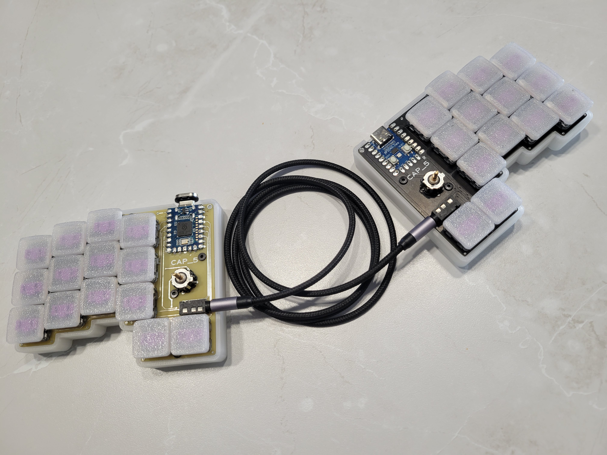

# BR/KN
BR/KN Keyboard (Broken)

[More pictures here](images/)

## Features

- 28 keys (plus 2 small tactiles, bonus!)
- 2x 16mm trackballs - PMw3360 sensors
- USB connection between halves (or TRRS option as backup)
- Low profile choc switches with CFX spacing (closer spacing then standard choc, only caps of size 16.50mm x 16.50mm will fit)
- RGB lighting
- Waveshare RP2040 Zero controllers
- QMK firmware

## Introduction

The Broken (stylized BR/KN) keyboard is named because... 

  1. it's a split (a broken unibody)
  2. Broken by Seether was my wife and mine's wedding song that I wanted to honor (queue awww's).  Ok enough on that, let's dig in.

I've always preferred small keebs and low switch counts.  The idea for this keyboard was to design a small split that also incorporated two trackballs (can use one for pointing, one for scrolling!), and have some other goodies like LEDs and tact switches for occasional needs like macros or toggling the RGB.

## Keymap

The layout is a larger rendition of my MM20 (3 column) layout which adds the side columms.  I have no issues with my 20 key layout but it's a BIG change for users and having some keys like tab and backspace on dedicated keys can be convenient.  Of course with custom firmware you are not locked into any specific layout.  If you only want to combo 2 letters (24 non-thumb keys, 26 letters!), then that's totally fine.

The layout, MM28, leverages combos (the yellow letters shown below) for less-used letters, or where they "feel best".  I performed some studies on letter frequency in the English language and most common bigrams and trigrams to determine the letter placement. It kind of started off as Colemak from what I recall, maybe it's actually really different, I forgets.  P and B are weird, they both just barely made it to combos instead of their own letters even though I use them more often then I anticipated.  They could have gone somewhere like the U and W keys but with the frequency I use them I wanted them on my index and middle finger instead of putting all that work on my ring finger.

The biggest thing with starting a layout like this is to accept the fact that you'll start off at like 5wpm but your brain will take over and it'll become second nature eventually just like any other layout.  It's super fun and not making any lateral finger movements feels nice. 

## Keycaps

As noted in the *Features*, I chose a narrower keyswitch spacing and thus they require narrower keycaps.  CFX keycaps are commercially available from Chosfox, or you can print your own, for which I've included files in the keycaps folder.  They easily print upside down on an FDM printer, and I use a textured baseplate.

## Miscellaneous Notes

- For the switchplate, I put the plate on then soldered the switches.  Makes sure you like your choice of filament that you printed the plate with because you're stuck with it ;).
- If you PCBA the board and the USB failed during manufacture, you can solder on a TRRS connector.  I have it designed to mount the TRRS on the bottom of the board to hide the connector and end of the cable within the case.  Also, you'll need to bodge two wires on the board to use TRRS, let me know if you need help if you go this route.
- The trackballs I used are 16mm polished mineral spheres I found on AliExpress.  I picked up a few different types of mineral and some were too large due to making a rock into a sphere not an exact science, so be mindful of that.  Alternatively, you can use human-made materials for a perfect spec 16mm ball.

## The predecessor (CAP 5)

[Another shot](images/20240416_134642.jpg)
